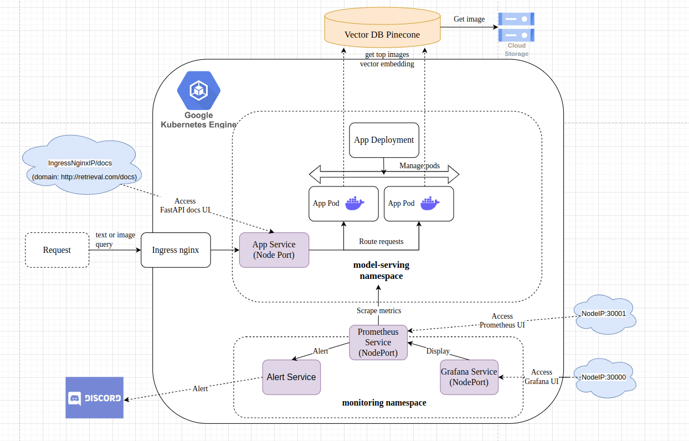
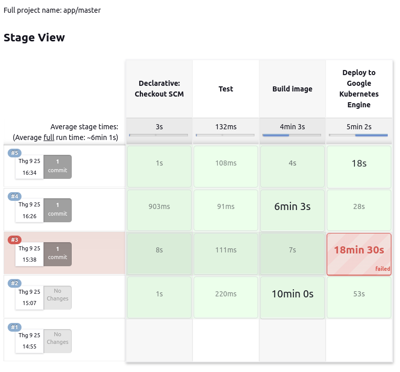

# Deploy [text image retrieval service](https://github.com/duongngyn0510/text-image-retrieval) to [Google Kubernetes Engine](https://console.cloud.google.com/kubernetes/list/overview?project=striking-decker-399102) using CI/CD
## System Architecture


## 1. Create GKE Cluster
### How-to Guide

#### 1.1. Create [Project](https://console.cloud.google.com/projectcreate) in GCP
#### 1.2. Install gcloud CLI
Gcloud CLI can be installed following this document https://cloud.google.com/sdk/docs/install#deb

Initialize the gcloud CLI
```bash
gcloud init
Y
```
+ A pop-up to select your Google account will appear, select the one you used to register GCP, and click the button Allow.

+ Go back to your terminal, in which you typed `gcloud init`, pick cloud project you using, and Enter.

+ Then type Y, type the ID number corresponding to **us-central1-f** (in my case), then Enter.

#### 1.3. Install gke-cloud-auth-plugin
```bash
sudo apt-get install google-cloud-cli-gke-gcloud-auth-plugin
```

#### 1.4. Create service account
Create your [service account](https://console.cloud.google.com/iam-admin/serviceaccounts), and select `Kubernetes Engine Admin` role (Full management of Kubernetes Clusters and their Kubernetes API objects) for your service account.

Create new key as json type for your service account. Download this json file and save it in `terraform` directory. Update `credentials` in `terraform/main.tf` with your this json file.

#### 1.5. Add permission for Project
Go to [IAM](https://console.cloud.google.com/iam-admin/iam), click on `GRANT ACCESS`, then add new principals, this principal is your service account created in step 1.3. Finally, select `Owner` role.


#### 1.6. Using [terraform](https://developer.hashicorp.com/terraform/tutorials/aws-get-started/install-cli) to create GKE cluster.
Update your [project id](https://console.cloud.google.com/projectcreate) in `terraform/variables.tf`
Run the following commands to create GKE cluster:
```bash
gcloud auth application-default login
```

```bash
cd terraform
terraform init
terraform plan
terraform apply
```
+ GKE cluster is deployed at **us-central1-f** with its node machine type is: **n2-standard-2** (2 CPU, 8 GB RAM and costs 71$/1month).
+ Unable [Autopilot](https://cloud.google.com/kubernetes-engine/docs/concepts/autopilot-overview) for the GKE cluster. When using Autopilot cluster, certain features of Standard GKE are not available, such as scraping node metrics from Prometheus service.

It can takes about 10 minutes for create successfully a GKE cluster. You can see that on [GKE UI](https://console.cloud.google.com/kubernetes/list/overview?project=striking-decker-399102)


#### 1.7. Connect to the GKE cluster.
+ Go back to the [GKE UI](https://console.cloud.google.com/kubernetes/list/overview?project=striking-decker-399102).
+ Click on vertical ellipsis icon and select **Connect**.
You will see the popup Connect to the cluster as follows

+ Copy the line `gcloud container clusters get-credentials ...` into your local terminal.

After run this command, the GKE cluster can be connected from local.

## 2. Deploy serving service manually
Using [Helm chart](https://helm.sh/docs/topics/charts/) to deploy application on GKE cluster.

### How-to Guide

#### 2.1. Create nginx ingress controller
```bash
cd helm_charts/nginx_ingress
kubectl create ns nginx-ingress
kubens nginx-ingress
helm upgrade --install nginx-ingress-controller .
```
After that, nginx ingress controller will be created in `nginx-ingress` namespace.

#### 2.2. Deploy application to GKE cluster manually
Text-image retrieval service will be deployed with `NodePort` type (nginx ingress will route the request to this service) and 2 replica pods that maintain by `Deployment`.

Each pod contains the container running the [text-image retrieval application](https://github.com/duongngyn0510/text-image-retrieval).

The requests will initially arrive at the Nginx Ingress Gateway and will subsequently be routed to the service within the `model-serving` namespace of the GKE cluster.

```bash
cd helm_charts/app
kubectl create ns model-serving
kubens model-serving
helm upgrade --install app --set image.repository=duong05102002/text-image-retrieval-serving --set image.tag=v1.5 .
```

After that, application will be deployed successfully on GKE cluster. To test the api, you can do the following steps:

+ Obtain the IP address of nginx-ingress.
```bash
kubectl get ing
```

+ Add the domain name `retrieval.com` (set up in `helm_charts/app/templates/app_ingress.yaml`) of this IP to `/etc/hosts`
```bash
sudo nano /etc/hosts
[your ingress IP address] retrieval.com
```
or you can take my ingress IP address
```bash
34.133.25.217 retrieval.com
```

+ Open web brower and type `retrieval.com/docs` to access the FastAPI UI and test the API.
    + For more intuitive responses, you can run `client.py` (Refresh the html page to display the images.)

        + Image query
            ```bash
            $ python client.py --save_dir temp.html --image_query your_image_file
            ```

            + **Top 8 products images similar with image query:**

                

                <html>
                    <body>
                        <div class="image-grid">
                
                        </body>
                    </html>
        + Text query
            ```bash
            $ python client.py --save_dir temp.html --text_query your_text_query
            ```
            + **Top 8 products images similar with text query: crop top**
                <html>
                    <body>
                        <div class="image-grid">
                
                        </body>
                    </html>

## 3. Monitoring Service
I'm using Prometheus and Grafana for monitoring the health of both Node and pods that running application.

Prometheus will scrape metrics from both Node and pods in GKE cluster. Subsequently, Grafana will display information such as CPU and RAM usage for system health monitoring, and system health alerts will be sent to Discord.

### How-to Guide

#### 3.1. Deploy Prometheus service

+ Create Prometheus CRDs
```bash
cd helm_charts/prometheus-operator-crds
kubectl create ns monitoring
kubens monitoring
helm upgrade --install prometheus-crds .
```

+ Deploy Prometheus service (with `NodePort` type) to GKE cluster
```bash
cd helm_charts/prometheus
kubens monitoring
helm upgrade --install prometheus .
```

*Warnings about the health of the node and the pod running the application will be alerted to Discord. In this case, the alert will be triggered and sent to Discord when there is only 10% memory available in the node.*

Prometheus UI can be accessed by `[Your NodeIP Address]:30001`

**Note**:
+ Open [Firewall policies](https://console.cloud.google.com/net-security/firewall-manager/firewall-policies) to modify the protocols and ports corresponding to the node `Targets` in a GKE cluster. This will be accept incoming traffic on ports that you specific.
+ I'm using ephemeral IP addresses for the node, and these addresses will automatically change after a 24-hour period. You can change to static IP address for more stability or permanence.


#### 3.2. Deploy Grafana service
+ Deploy Grafana service (with `NodePort` type) to GKE cluster

```bash
cd helm_charts/grafana
kubens monitoring
helm upgrade --install grafana .
```

Grafana UI can be accessed by `[Your NodeIP Address]:30000` (with both user and password is `admin`)

Add Prometheus connector to Grafana with Prometheus server URL is: `[Your NodeIP Address]:30001`.

This is some `PromSQL` that you can use for monitoring the health of node and pod:
+ RAM usage of 2 pods that running application
```shell
container_memory_usage_bytes{container='app', namespace='model-serving'}
```
+ CPU usage of 2 pods that running application
```shell
rate(container_cpu_usage_seconds_total{container='app', namespace='model-serving'}[5m]) * 100
```


+ Node usage


## 4. Continous deployment to GKE using Jenkins pipeline

Jenkins is deployed on Google Compute Engine (create Google Compute instance using [ansible](https://docs.ansible.com/ansible/latest/playbook_guide/playbooks_intro.html)) with a machine type is **n1-standard-2**.

### How-to Guide

#### 4.1. Spin up your instance
Create your [service account](https://console.cloud.google.com/), and select [Compute Admin](https://cloud.google.com/compute/docs/access/iam#compute.admin) role (Full control of all Compute Engine resources) for your service account.

Create new key as json type for your service account. Download this json file and save it in `secret_keys` directory. Update your `project` and `service_account_file` in `ansible/deploy_jenkins/create_compute_instance.yaml`.

```bash
cd deploy_jenkins
ansible-playbook create_compute_instance.yaml
```

Go to Settings, select [Metadata](https://console.cloud.google.com/compute/metadata) and add your SSH key.

#### 4.2. Install Docker and Jenkins

Update the IP address of the newly created instance and the SSH key for connecting to the Compute Engine in the inventory file. Then run the following commands:

```bash
cd deploy_jenkins
ansible-playbook -i ../inventory deploy_jenkins.yml
```

#### 4.3. Connect to Jenkins UI in Compute Engine
Access the instance using the command:
```bash
ssh -i ~/.ssh/id_rsa your_username@your_external_ip
```
Check if jenkins container is already running ?
```bash
sudo docker ps
```
Open web brower and type `your_external_ip:8081` for access Jenkins UI. To Unlock Jenkins, please execute the following commands:
```shell
sudo docker exec -ti jenkins bash
cat /var/jenkins_home/secrets/initialAdminPassword
```
Copy the password and you can access Jenkins UI.

#### 4.4. Install Kubernetes plugin

Install the Kubernetes, Docker, Docker Pineline, GCloud SDK Plugins at `Manage Jenkins/Plugins` and set up a connection to GKE by adding the cluster certificate key at `Manage Jenkins/Clouds`.


Don't forget to grant permissions to the service account which is trying to connect to our cluster by the following command:

```shell
kubectl create clusterrolebinding cluster-admin-binding --clusterrole=cluster-admin --user=system:anonymous

kubectl create clusterrolebinding cluster-admin-default-binding --clusterrole=cluster-admin --user=system:serviceaccount:model-serving:default
```

#### 4.5. Continous deployment

Install **Helm** on Jenkins using the `Dockerfile-jenkins-k8s` to enable application deployment on GKE cluster. After that, push this image to Dockerhub or you can reuse my image `duong05102002/jenkins-k8s:latest`

The CI/CD pipeline will consist of three stages:
+ Tesing model correctness.
+ Building the image, and pushing the image to Docker Hub.
+ Finally, it will deploy the application with the latest image from DockerHub to GKE cluster.


